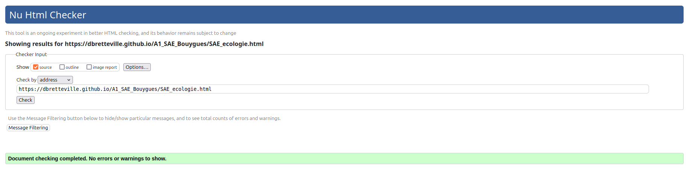

### Sujet : Bouygues Telecom  
[Lien Github](https://dbretteville.github.io/A1_SAE_Bouygues)  
[Lien Gitlab](https://matheob.gitlab.io/A1_SAE_Bouygues/)  
[Lien BitBucket](https://a1_sae_bouygues-admin@bitbucket.org/a1_sae_bouygues_telecom/a1_sae_bouygues.git)

### Membre du groupe :
- VALENTIN BEURET - Email : valentin.beuret@edu.univ-fcomte.fr
- GAUTIER BELEY - Email : gautier.beley@edu.univ-fcomte.fr
- MATHEO BONNET - Email : matheo.bonnet@edu.univ-fcomte.fr
- SIDI MOHAMED HADI BENHADJEBA - Email : sidi_mohamed_hadi.benhadjeba@edu.univ-fcomte.fr
- DAMIEN BRETTEVILLE - Email : damien.bretteville@edu.univ-fcomte.fr

### Présentation du sujet :  
C'est un site qui a pour but de de présenter l'entreprise Bouygues Telecom tout en respectent un cahier des charges qu'on a nous meme suggérer.

### Choix de conception :  
Pour la création de ce site web, il y a plusieurs sites qu'ils nous ont inspiré comme celui officiel de Bouygues Telecom ,[Site officiel de Bouygues Telecom](https://www.bouyguestelecom.fr/?utm_medium=sea_c&utm_source=google&utm_campaign=bouygues-m-variantes&utm_term=site%20bouygues%20telecom&gclsrc=aw.ds&gad_source=1&gclid=CjwKCAjw68K4BhAuEiwAylp3kt3aCkKpDOYeGZzhFwz80ZyEf1iArkPgwgG5LULX5eaV2x32tiksKBoCi3gQAvD_BwE), et du site EDF invest,[site de EDF Invest](https://www.edfinvest.fr/). 

### Développement Site Web et Validation des pages

### Page d'accueil 

Auteur : Beley Gautier  
Vérification W3C : [Détail ici](https://validator.w3.org/nu/?doc=https%3A%2F%2Fdbretteville.github.io%2FA1_SAE_Bouygues%2Findex.html)

### Histoire

Auteur : Beuret Valentin  
Vérification W3C : [Détail ici]()

### Economie

Auteur : Bretteville Damien  
Vérification W3C : [Détail ici]()

### Ecologie

Auteur : Bonet Mathéo   
Vérification W3C : [Détail ici]()

### Actualité

Auteur : Benhadjeba Sidi Mohamed  
Vérification W3C : [Détail ici]()

### Contact

Auteur : Beuret Valentin  
Vérification W3C : [Détail ici]()

### Répartition du travail

### Planification - Diagramme de GANTT

- Benhadjeba Sidi Mohamed

### Recherches d'informations

- Beley Gautier
- Bonnet Mathéo
- Benhadjeba Sidi Mohamed
- Beuret Valentin
- Bretteville Damien

### Rapport économique

- Beley Gautier
- Bonnet Mathéo
- Benhadjeba Sidi Mohamed
- Beuret Valentin
- Bretteville Damien

### Développement site

- Beley Gautier
  - Page d’accueil
- Bonnet Mathéo 
  - "Template" de page (Navbar/Footer)
  - Page Ecologie 
- Beuret Valentin
  - Page histoire
- Bretteville Damien
  - Page Economie
- Benhadjeba Sidi Mohamed
  - Page Actualité

## Contributeurs

### Validation ecoIndex du site 

Validation : [Détail ici](https://cdn.discordapp.com/attachments/1033349040466837525/1296720509760704532/ecoIndex.png?ex=67135095&is=6711ff15&hm=259c4e28255cd3ccc17d8e0d038a7afc7ef14f998ed03b8e18cf6a919f80a6a1&)

